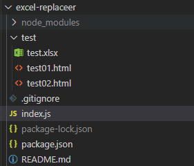

「このExcelのA列のファイルのB列の文字列をC列の文字列にしてクレメンス！ちな、7,000件な！」  
さすがに手入力はやってられん。という事で、Node.js で自動化してみました。

※ 完成品のコードは[こちら](https://github.com/daichi-iwamoto/excel-replaceer)

## テスト環境の下準備

Node.jsはインストール済みで最低限のjs知識がある方を前提として  
最終的なディレクトリ構造はこんな感じを想定してます。



### プロジェクトの作成

任意のディレクトリを作成して`npm init`しましょう。  
入力項目は任意で決めて大丈夫です。

```bash:bash
mkdir excel-replaceer
cd excel-replaceer
npm init
```

### モジュールのインストール

今回使用するモジュールは`fs`と`xlsx`の2つです。

fs : https://www.npmjs.com/package/fs  
xlsx : https://www.npmjs.com/package/xlsx

```bash:bash
npm install fs
npm install xlsx
```

### テスト用のExcelファイルの作成

読み込んでくる`test.xlsx`ファイルを作成します。  
今回はプロジェクト直下に`/test`というディレクトリを作成し   
そこに読み込んでくるExcelファイルと置換するhtmlファイルを設置します。

今回、Excelのデータ内容は下記の様な感じで作成します。

|  | A | B | C |
| --- | --- | --- | --- |
| 1 | test01.html | dummy | test01 |
| 2 | test02.html | dummy | test02 |
| 3 | test03.html | dummy | test03 |

### テスト用のhtmlファイルの作成

今回のテストで置換するhtmlファイルを作成します。  
『A列』に記載がある通りの名前でhtmlを3つ作成してください。  
ディレクトリはExcelファイルと同様`/test`配下に保存します。

htmlファイルの中身は任意で決めてもらえばよいですが、  
今回は『B列』の「dummy」を置換するのでどこかしらにdummyを記述してください。

```html:title=test01,2,3.html
<html lang="en">
<head>
    <meta charset="UTF-8">
    <meta name="viewport" content="width=device-width, initial-scale=1.0">
    <title>dummy</title>
</head>
<body>
    
</body>
</html>
```

これでテストを行う為の下準備は完了です。

## モジュール作成

次は実際にExcelから情報を取得して、置換処理を行うまでの解説です。

### `index.js`の作成

プロジェクト直下に`index.js`を作成してください。  
ここに実際の置換処理を書いていきます。

### `node module`の読み込み

下準備の段階でインストールを行った`fs`と`xlsx`を使用するので  
この2つを呼び出して、いつでも使えるように変数に格納します

```js:title=index.js
const xlsx = require('xlsx');
const utils = xlsx.utils;
const fs = require('fs');
```

`utils`は`xlsx`の機能の一つで、  
こちらも毎回呼び出す手間を省く為に変数に格納しています。
これでモジュールを使う準備ができました。

### Excelファイルの読み込み

Excelファイルの操作は`xlsx`モジュールを使用して行います。

```js:title=index.js
// 上部 略

const testX = xlsx.readFile('./test/test.xlsx');
const sheet = testX.Sheets['Sheet1'];
```

`readFile`を使用することによってExcelファイルの読み込みができます。  
読み込んだExcelの内容を`textX`に格納し、その中の`Sheet1`の情報を  
`sheet`変数に格納しています。

セルの値を取得する為には`sheet['A1']`というように  
シート情報からセル名を指定して取得してきますが、  
今回は入力されている範囲を取得して、ループを回してデータを取得します。

### 範囲の取得

```js:title=index.js
// 上部 略

const range = sheet['!ref'];
const rangeN = utils.decode_range(range);
```

次にシートの記載がある範囲を取得します。  
先ほどシートの情報を格納した`sheet`変数から`['!ref]`を指定すると  
範囲が取得できるので、こちらを`renge`の変数に格納します。  
今回の場合、`range`には『A1:C2』が入っています。

範囲を取得することはできましたが、今取得してきた範囲は  
テキストデータになっている為、A列からC列までループ処理は回せません。  
これを解決するために`utils`を使用していきます。

`utils`の`decode_range()`を使用して、  
先ほどとってきたテキストデータの範囲を渡してあげる事で、  
詳細な範囲データを返してくれます。これを`rangeN`に格納しています。  
中身は下記の様になっています。

```js
{ s: { c: 0, r: 0 }, e: { c: 2, r: 1 } }
```

それぞれ情報内容はこんな感じ

| key | 情報 |
| --- | --- |
| s | スタートのセル情報 |
| e | エンドのセル情報 |
| c | 列 (A, B, C ~~) の情報 |
| r | 行 (0, 1, 2 ~~) の情報 |

この情報を利用すれば、ループ分を回して行数分実行したり  
列分実行したり、全レコード分実行したりできます。

今回は『B列』に元データ『C列』に変更後データがある状態を想定して作るので  
行数分、置換が実行できれば良いことになります。

### ループ・置換処理

今回は『A列』に置換したいファイル名が記載されており、  
『B列』に変更前の文字列、『C列』に変更後の文字列が記載されているので  
行数分、置換処理を実行すれば良いことになります。

`for文`で行数分ループするようにしましょう。

```js:title=index.js
// 上部 略

for (let r = rangeN.s.r; r <= rangeN.e.r; r++) {
    let address = utils.encode_cell({c:0, r:r});
    let cell = sheet[address];
}
```

```js
for (let r = rangeN.s.r; r <= rangeN.e.r; r++)
```

で`rangeN.s.r`のスタートの行番号から、  
`rangeN.e.r`のエンドの行番号までループする処理を書きます。

次にセルの情報を取得してきます。  
『A列』に置換したいファイル名が記載されているので  
列のインデックス番号である`c`を`c:0`で固定して編集するファイルを取得しましょう。

```js
let address = utils.encode_cell({c:0, r:r});
let cell = sheet[address];
```

`utils`の`encode_cell()`を使用することで`c`と`r`のプロパティで  
指定されたセルを、テキストベースに変換してくれます。

`let address = utils.encode_cell({c:0, r:0});`  
の場合は、addressに「A1」が入ります。

これで、`cell`に『A列』のデータ（ファイル名）が入るように設定できました。  
指定のファイルを読み込んでみましょう。

```js
// fs.readFile([読み込むファイルのパス], [読み込む文字コード], [コールバック関数]); 
fs.readFile('./test/' + cell.v, 'utf-8', (err, data) => {
    // エラー処理
    if (err) {
        console.log(`【 ${cell.v} 】ファイル読み込みエラー`);
        throw err;
    }
});
```

ファイルの読み書きには`fs`モジュールを使用します。  
ファイルの読み込みでは`readFile()`を使用します。  
上記のように、簡単なエラー処理も書いておきましょう。  
このコールバック関数内で、置換の処理を行っていきます。  
コールバック関数で渡している`data`には取得してきた内容が入っています。

```js:title=index.js
// 変更前の内容を取得
let B_address = utils.encode_cell({c:1, r:r});
let B_cell = sheet[B_address];

// 変更後の内容を取得
let A_address = utils.encode_cell({c:2, r:r}); 
let A_cell = sheet[A_address];

// 置換
const beforeTxt = data;
const afterTxt = beforeTxt.replace(new RegExp(B_cell.v,"g"), A_cell.v);
```

今回は『B列』に変更前の文字列、『C列』に変更後の文字列が  
入っていることがわかっているので、それぞれ『A列』の情報を  
とってきた時と同様に、`c`プロパティを固定して情報を取ってきます。

あとはおなじみの`replace()`を使用して置換をおこない  
`afterTxt`に格納しておきます。

```js:title=index.js
// fs.writeFile([書き込むファイルパス], [書き込む内容], コールバック関数)
fs.writeFile('./test/' + cell.v, afterTxt, (err) => {
    if (err) {
        console.log(`【 ${cell.v} 】ファイル置換エラー`);
        throw err;
    }

    console.log(`【 ${cell.v} 】success !`);
});
```

最後にファイルの上書きを行っていきます。  
ファイルの書き込みには`writeFile()`を使用します。  
こちらにも簡単なエラー処理を書いてあげましょう。

`index.js`の完成形はこんな感じ

```js:title=index.js
// モジュールのインストール
const xlsx = require('xlsx');
const utils = xlsx.utils;

const fs = require('fs');

// エクセルファイルの読み込み
const testX = xlsx.readFile('./test/test.xlsx');

// シートの読み込み
const sheet = testX.Sheets['Sheet1'];

// セルの範囲の取得
const range = sheet['!ref'];
// console.log(range);

// セルの範囲を数値化
const rangeN = utils.decode_range(range);

// ループ処理
for (let r = rangeN.s.r; r <= rangeN.e.r; r++) {
    // ファイル名取得
    let address = utils.encode_cell({c:0, r:r});
    let cell = sheet[address];

    // htmlの読み込み
    fs.readFile('./test/' + cell.v, 'utf-8', (err, data) => {
        // エラー処理
        if (err) {
            console.log(`【 ${cell.v} 】ファイル読み込みエラー`);
            throw err;
        }

        // 置換処理
        // 変更前の内容を取得
        let B_address = utils.encode_cell({c:1, r:r});
        let B_cell = sheet[B_address];

        // 変更後の内容を取得
        let A_address = utils.encode_cell({c:2, r:r}); 
        let A_cell = sheet[A_address];

        // 置換
        const beforeTxt = data;
        const afterTxt = beforeTxt.replace(new RegExp(B_cell.v,"g"), A_cell.v);
        
        // ファイルの上書き
        fs.writeFile('./test/' + cell.v, afterTxt, (err) => {
            if (err) {
                console.log(`【 ${cell.v} 】ファイル置換エラー`);
                throw err;
            }

            console.log(`【 ${cell.v} 】success !`);
        });
    });
}
```

これで処理は完成しました！

## 処理の実行

最後に下記で実行して置換が行われるか試してみてください！

```bash
node index.js
```

<script type="application/ld+json">
{
  "@context": "http://schema.org",
  "@type": "Article",
  "name": "Node.jsでExcelを元にファイル一括編集",
  "headline": "Node.jsでExcelを元にファイル一括編集",
  "author": {
    "@type": "Person",
    "name": "Daichi Iwamoto"
  },
  "image": {
    "@type": "ImageObject",
    "url": "https://placehold.jp/1200x600.png",
    "height": 600,
    "width": 1200
  },
  "description": "「このExcelのA列のファイルのB列の文字列をC列の文字列にしてクレメンス！ちな、7,000件な！」さすがに手入力はやってられん。という事で、Node.js で自動化してみました。",
  "url": "https://noob-front-end-engineer-blog.com/node-excel-replacer/",
  "mainEntityOfPage": "https://noob-front-end-engineer-blog.com/node-excel-replacer/",
  "publisher": {
    "@type": "Organization",
    "name": "Noob Front End Engineer Blog",
    "logo": {
      "@type": "ImageObject",
      "url": "https://noob-front-end-engineer-blog.com/favicon-32x32.png",
      "width": 32,
      "height": 32
    }
  },
  "datePublished": "2020-08-12",
  "dateModified": "2020-08-12"
}
</script>
