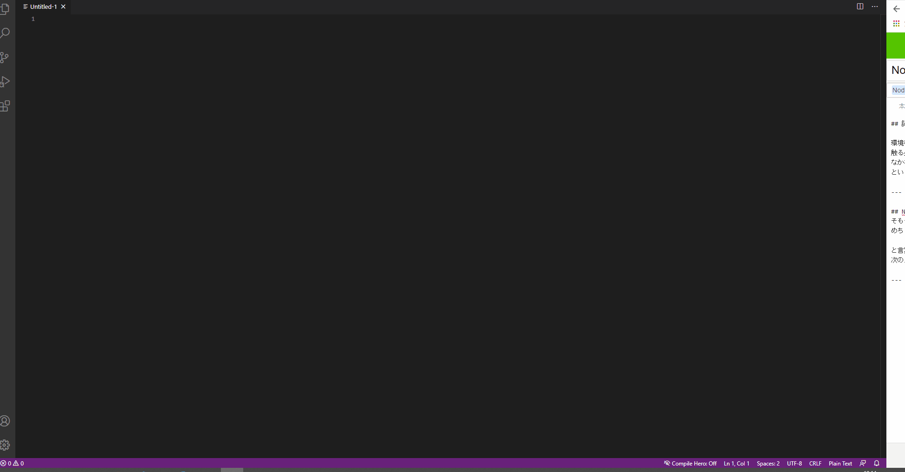

## 記事概要

今回は、フロントエンド界隈では必須のスキルとなりつつある`Node.js`の解説を行っていきます！  
環境構築から、実際に簡単なモジュールの使用方法まで紹介します。

## Node.js とは

そもそも[Node.js](https://nodejs.org/ja/)とは何ぞやというところですが、  
よく説明で使われるのは「サーバーサイドで動くJavaScript」です。  
言葉で聞いてもピンと来ないので、実際に手を動かして見てみましょう！

下記の様な手順で作業を行ってみると、  
素のJavaScriptとNode.jsの違いが感覚的につかめるかと思います。

1. デスクトップ等に`test`を出力する`js`ファイルを作成
2. `js`ファイルをダブルクリックで実行しようとするとエラーが出る
3. `Node.js`を使用してコマンドラインから作成したスクリプトを実行すると`test`が出力される



素の`js`はブラウザ上では動作しますが、ローカルOSやサーバー上では動作しません。  
しかし、`Node.js`を介して`js`を実行する事で本来クライアントサイドでしか実行されない`js`を  
バックエンド言語としても使用できるようになります。

<div class="kao sleep">
慣れ親しんだJSでバックエンドの処理も書ける事から、フロントエンドエンジニアを中心に人気が高まったようです
</div>

正確には違うかもしれませんが、  
これがサーバーサイドで動くってことかぁ  
となんとなく感じでいただけたかと思います！

では次に、`Node.js`でよく使用される  
`npm`について見ていきましょう。

## npm とは

[npm](https://www.npmjs.com/)はパッケージ管理システムの一種です。

`npm`上には凄い人たちが作った、凄いモジュールが沢山あります。  
`Node.js`ではそれらのモジュールをインストールする事で  
使用することができるのですが、そのインストールの際に`npm`を使用します。

モジュールは依存関係を持っている事が多く、  
「モジュールAを使用するためにはモジュールBが必要で  
そのモジュールBを使用するためにはモジュールCが～…」  
みたいなことが頻繁に起きます&#x1f62d;

`npm`はこのような事件を解決して  
モジュールAをインストールする。と実行するだけで  
そのモジュールを実行するために必要なモジュールを併せてインストールしてきてくれます。

<div class="kao sleep">
PHPでいうところのcomposerと同じ役割ですね
</div>

## モジュールの使用方法

では、実際にモジュールを使用してみましょう！  
まずは、今回作業するディレクトリを作成してください。  
私はデスクトップに`test`というディレクトリを作成して説明を行っていきます。

※ Node.jsはインストール済みを想定しています。  
※ ターミナルはgit bashを使用しています。

### 下準備

まずは該当のディレクトリに移動して、下記コマンドを打ってみましょう。

```bash
npm init
```

色々と入力を求められますが、すべてEnterで大丈夫です。  
すると`package.json`というファイルができるのでこのファイルを開いてみましょう。

`package.json`の中の`"scripts"`に  
`"test"`というscriptがあるかと思います。  
この部分を下記の様に書き換えてみましょう。

```json:title=package.json
  "scripts": {
    "test": "echo hello world !"
  }
```

そして、下記コマンドを実行すると「hello world !」が  
表示されるはずです！

```bash
npm run test
```

これが基本的な`npm-scripts`の実行方法です。

`npm-scripts`を実行する際は`package.json`がある  
ディレクトリで`npm run [スクリプト名]`で実行が可能です!

次はnpmでモジュールをインストールして、  
そのモジュールを使用したスクリプトを作成・実行していきましょう。

### モジュールの使用

今回は例として[onchange](https://www.npmjs.com/package/onchange)モジュールを使用してみましょう。  
このモジュールはファイルの変更を検知してくれるという機能になります。  
下記コマンドでインストールを行いましょう。

```bash
npm install onchange
```

インストールが完了したのを確認したら`package.json`を見てみましょう。  
すると、`"dependencies"`という項目に`"onchange"`が追加されていると思います。  
これがあることで、`npm install`コマンドを打つだけで、  
`onchange`モジュールをインストールしてきてくれます。

つまり、複数人で開発を行う際`package.json`が共有されていれば、  
その階層で`npm install`を行うだけで`"dependencies"`にあるモジュール群を  
全てインストールしてきてくれるという仕組みです！

必要なモジュールをひとりひとりが一個ずつ  
インストールする必要が無いのは、このおかげです。

それではインストールしてきた`onchange`モジュールを実際に使ってみましょう。  
詳細な使用方法は[公式](https://www.npmjs.com/package/onchange)にあるので、そちらを参考にしてください。

まずは今回使用しているディレクトリの中に、`src`というディレクトリを作成してください。

次に、`package.json`を開いて先ほど編集した  
`"scripts"`の`"test"`の箇所を下記の様に変更してください。

```json:title=package.json
  "scripts": {
    "test": "onchange src/* -- echo {{changed}}"
  }
```

行っている事としては下記のような感じです。

```json
onchange [監視するファイル] -- [変更があったときに実行されるスクリプト]
```

今回は、『`src`ディレクトリ内で、変更があったら変更があったファイル名を出力する。』という単純なものです。

途中で使われている`{{changed}}`というのも`onchange`モジュールの機能の一つで、  
変更が検知されたファイルのファイル名を教えてくれます。

では、実際にスクリプトを実行してみましょう。

```bash
npm run test
```

すると、監視モードになると思うので、  
作成した`src`ディレクトリに適当なファイルを作成したり  
編集したりしてみてください。変更したファイル名が出力されたら成功です&#x1f973;

以上が`Node.js`の簡単な説明になります！今回使用した`onchange`モジュールは使い方次第で  
色々な用途に使用できるので、とてもおすすめです。

今までは`Node.js`を使ってはるけど、どんなものなのかをあまり理解してなかったので、  
同じような人の助けになれば幸いです！

<script type="application/ld+json">
{
  "@context": "http://schema.org",
  "@type": "Article",
  "name": "触って直感で覚えるNode.js入門",
  "headline": "触って直感で覚えるNode.js入門",
  "author": {
    "@type": "Person",
    "name": "Daichi Iwamoto"
  },
  "image": {
    "@type": "ImageObject",
    "url": "https://placehold.jp/1200x600.png",
    "height": 600,
    "width": 1200
  },
  "description": "フロントエンド界隈では必須のスキルとなりつつある「Node.js」の解説を行っていきます。環境構築から簡単なモジュールの使用方法まで紹介します。",
  "url": "https://noob-front-end-engineer-blog.com/node-js-starter/",
  "mainEntityOfPage": "https://noob-front-end-engineer-blog.com/node-js-starter/",
  "publisher": {
    "@type": "Organization",
    "name": "Noob Front End Engineer Blog",
    "logo": {
      "@type": "ImageObject",
      "url": "https://noob-front-end-engineer-blog.com/favicon-32x32.png",
      "width": 32,
      "height": 32
    }
  },
  "datePublished": "2020-08-12",
  "dateModified": "2020-08-12"
}
</script>
