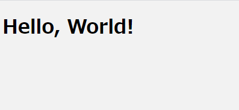
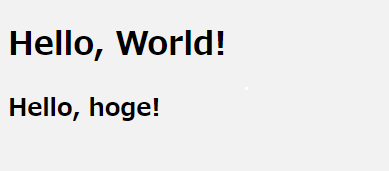
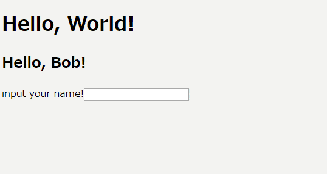

## 概要

Reactの入門として、Reactの基本的な機能群を使用してHello Worldを行ってみました。

・ノーマル Hello World  
・関数コンポーネント Hello World  
・クラスコンポーネント Hello World

## 導入

[Create React App](https://ja.reactjs.org/docs/create-a-new-react-app.html#create-react-app)を使用して環境構築を行います。  
`npm`のバージョンが 5.2 以上であれば`npx`が  
デフォルトで入っているはずなので下記で導入ができます。

```bash
npx create-react-app my-app
cd my-app
npm start
```

## Sass & Scss 導入

[こちら](https://qiita.com/yikeda6616/items/0e31a920d533d70c0bd9)の記事を参考に`node-sass`を導入して`sass`を使えるようにしました。

## ① まずはノーマルの Hello world！

`/src/index.js`を下記の様に書き換えてください。

```js:title=/src/index.js
import React from 'react';
import ReactDOM from 'react-dom';
import './sass/index.scss';

const say = 'Hello, World!';

ReactDOM.render(
  <div>
    <h1>{ say }</h1>
  </div>,
  document.getElementById('root')
);
```

### ポイント

- ReactとReactDomをimportしていないと怒られます。
- ReactDom.render内で、表示するDOMを定義しています。
- getElementで取得している`id="root"`というDOM内に追加されます。
- ReactDom.renderで返されるDOMは1つのDOM要素である必要があります。  
  今回は1つの`<div>`要素を返していることになります。
- 3 行目の`import './sass/index.scss';`でscssを読み込んでいます。  
  `/src/sass/`のディレクトリに`index.scss`を作成して、背景色等を変更し、  
  変更が適用されるか確認してみましょう。

```scss:/src/sass/index.scss
body {
  background: #f2f2f2;
}
```

### 表示結果

上記の様に実装すると、このように表示されるはずです&#x1f609;



変数`say`に入れる文言を変更してみて、表示される内容が変わるか試してみてください！

## ② 関数コンポーネントで Hello World！

今度は`/src/index.js`を下記の様に書き換えてください。

```js:title=/src/index.js
import React from 'react';
import ReactDOM from 'react-dom';
import './sass/index.scss';

const say = 'Hello, World!';

// 関数コンポーネント
function Hello(props) {
  return <h2>Hello, {props.name}!</h2>;
}

ReactDOM.render(
  <div>
    <h1>{ say }</h1>
    <Hello name="hoge" />
  </div>,
  document.getElementById('root')
);
```

### ポイント

- 関数コンポーネントとは文字通り、関数によって作られたコンポーネントです。  
  render 内で呼び出す際には関数名を呼び出します。
- 関数コンポーネントは引数としてpropsを受け取ります。    
  render 内で呼び出しの際に記述している`name="hoge"`がprops.nameで使用できます。
- render 内で記述されるタグは頭文字が小文字の場合DOM要素、  
  頭文字が大文字の場合コンポーネントとして認識されます。

### 表示結果

上記の様に実装を行うとこのように表示されるはずです。



Hello コンポーネントを呼び出している箇所で渡す名前を自分の名前に変更してみてください。  
挨拶してくれるはずです&#x1f64b;

## ③ クラスコンポーネントで Hello World！

今度は`/src/index.js`を下記の様に書き換えてください。

```js:title=/src/index.js
import React from 'react';
import ReactDOM from 'react-dom';
import './sass/index.scss';

const say = 'Hello, World!';

// クラスコンポーネント
class Hello extends React.Component {
  constructor(props) {
    super(props);
    this.state = {
      name: 'Bob'
    }
  }

  setName = (e) => {
    this.setState({
      name: e.target.value
    });
  }

  render() {
    return (
      <div>
        <h2>Hello, {this.state.name}!</h2>
        <label for='name'>input your name!</label>
        <input type='text' onChange={this.setName} />
      </div>
    );
  }
}

ReactDOM.render(
  <div>
    <h1>{ say }</h1>
    <Hello />
  </div>,
  document.getElementById('root')
);
```

### ポイント

- クラスコンポーネントは独自のstate(状態)を持つことができます。
- state を使用する場合にはコンストラクタが必須になり、  
  このコンストラクタ内で`state`の初期値を設定します。  
  また、このコンストラクタでは必ず引数に props を受け取り、`super(props)`を行う必要があります

```js
  constructor(props) {
    super(props);
    this.state = {
      name: 'Bob'
    }
  }
```

- stateは直接変更をしてはいけません。  
  今回の場合は`<input type='text' onChange={this.setName} />`で  
  `this(コンポーネント内の).setName`を呼び出して、その関数内で`setState`を使用して  
  stateを変更しています。

```js
  setName = (e) => {
    this.setState({
      name: e.target.value
    });
  }
```

- クラスコンポーネント内の`render()`で返却する DOM 要素を定義しています。  
  ここでも DOM 要素を 1 つで返す必要があるので、`<div>`で囲っています。
- コンポーネント内の state を DOM 要素内で取得する場合は`{this.state.name}`  
  というように記述します。

```js
  render() {
    return (
      <div>
        <h2>Hello, {this.state.name}!</h2>
        <label for='name'>input your name!</label>
        <input type='text' onChange={this.setName} />
      </div>
    );
  }
```

### 表示結果

上記の様に実装を行うとこのように表示されるはずです。



名前を入力して変更されるか試してみてください&#x1f604;

<script type="application/ld+json">
{
  "@context": "http://schema.org",
  "@type": "Article",
  "name": "React Hello World Examples",
  "headline": "React Hello World Examples",
  "author": {
    "@type": "Person",
    "name": "Daichi Iwamoto"
  },
  "image": {
    "@type": "ImageObject",
    "url": "https://placehold.jp/1200x600.png",
    "height": 600,
    "width": 1200
  },
  "description": "Reactの入門として、Reactの基本的な機能群を使用してHello Worldを行ってみました。",
  "url": "https://noob-front-end-engineer-blog.com/npm-script-images/",
  "mainEntityOfPage": "https://noob-front-end-engineer-blog.com/npm-script-images/",
  "publisher": {
    "@type": "Organization",
    "name": "Noob Front End Engineer Blog",
    "logo": {
      "@type": "ImageObject",
      "url": "https://noob-front-end-engineer-blog.com/favicon-32x32.png",
      "width": 32,
      "height": 32
    }
  },
  "datePublished": "2020-08-12",
  "dateModified": "2020-08-12"
}
</script>
